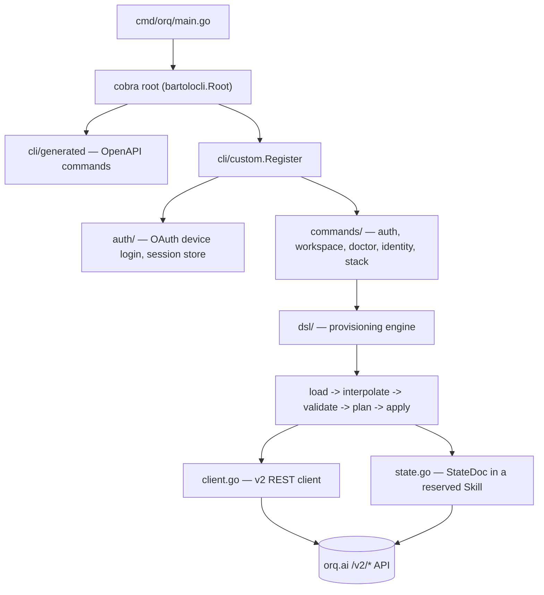

<!-- generated-by: gsd-doc-writer -->

# Architecture

> Code-level companion to [`docs/architecture.md`](docs/architecture.md) (the hand-written mkdocs
> narrative for end users). This document focuses on the Go package layout, the concrete
> call chain, and the abstractions an engineer extending the codebase needs — derived directly
> from `cli/custom/dsl/` and `cmd/orq/`.

## System overview

`orq` is a single Go binary (module `orq`, entrypoint `cmd/orq/main.go`) that combines two
command surfaces on one cobra root: an auto-generated REST client for the full orq.ai OpenAPI
surface (`cli/generated/`, produced by the `bartolo` code-generator and never hand-edited), and a
hand-written command tree (`cli/custom/`) covering authentication, workspace selection,
diagnostics, and — the largest and most architecturally distinct piece — `orq stack` (alias
`orq dsl`): a Terraform-style declarative provisioning engine. `orq stack` reads a directory of
YAML manifests describing orq.ai resources (Projects, Prompts, Agents, Evaluators, Knowledge
Bases, Datasets, Tools, Memory Stores, Skills), diffs them against the live workspace over the
public `/v2/*` REST API, and reconciles the two with `validate` / `plan` / `apply` / `pull` /
`destroy`. Ownership state (which resources the stack manages) is not kept in a local file; it is
stored server-side as a JSON document inside a reserved Skill entity, so laptops and CI runners
converge on the same source of truth.

## Component diagram



`cli/generated/` and the `dsl/` engine both ultimately speak to the same `/v2/*` API, but through
different HTTP clients: generated commands go through bartolo's `gentleman`-based middleware
chain (session/apikey auth injected in `cli/custom/register.go`), while the `dsl` package uses its
own minimal `net/http` client (`cli/custom/dsl/client.go`) so its error handling, retry policy,
and (in tests) transport can be controlled precisely.

## Data flow

A typical `orq stack apply -f ./stack` run walks the same pipeline every `dsl` command is a
prefix of, implemented across dedicated files:

1. **Command dispatch** — `cli/custom/commands/dsl.go` (`NewDSLCommand`) registers `stack`
   (alias `dsl`) with subcommands `init`, `validate`, `plan`, `apply`, `pull`, `destroy`,
   `state list`. `apply`'s `RunE` calls `buildPlanFromFlags`, shared with `plan` and `destroy`.
2. **Load** — `dsl.LoadStack` (`loader.go`) reads `orq.yaml` for the stack name and defaults;
   `dsl.LoadManifests` walks the directory for `*.yaml`/`*.yml` (excluding `orq.yaml` and
   `vars/`), decodes multi-document files with `gopkg.in/yaml.v3`, and applies `defaults.path`
   to any manifest missing `metadata.path`.
3. **Interpolate** — `dsl.ResolveVars` merges variable sources (`orq.yaml` < `--var-file` <
   `--var k=v` < `ORQ_VAR_<name>` env, later wins); `dsl.Interpolate` (`interp.go`) rewrites
   `${var.*}`, `${env.*}`, and `{$file: rel}` nodes in every manifest's `spec` in place.
4. **Validate** — `dsl.Validate` (`validate.go`) checks each manifest against the kind contract
   in `dsl.Registry()` (`registry.go`): identity mode, required spec fields, platform charset
   rules, kind-specific spec shape (Evaluator/Tool/KnowledgeBase discriminators), `ref:` syntax,
   and duplicate identities. Fully offline — no `Client` is constructed at this stage.
5. **Fetch live + symbolize** — `dsl.BuildPlan` (`plan.go`) fans out `dsl.FetchLive` (`live.go`)
   across all manifests (bounded to 4 concurrent goroutines). Resolution order per manifest:
   state entry → `GET` by stored server id; else identity-addressable kinds → `GET` by identity
   value; else `Client.ListAll` + client-side match. Live objects then pass through
   `symbolizeLive` (`diff.go`), which rewrites known server ids back into `{ref: key}` shape
   using the state document's id→identity map, so desired and live compare in the same
   vocabulary.
6. **Diff** — `dsl.Classify` (`diff.go`) calls `DiffSpec` (managed-fields comparison: only
   fields present in the manifest are compared; live-only fields are ignored) and produces a
   `Change{Op: create|update|delete|replace|noop}`. A path listed in the kind's `Immutable` set
   forces `OpReplace`.
7. **Waves** — `dsl.BuildWaves` (`refs.go`) topologically sorts non-noop changes with Kahn's
   algorithm over explicit `ref:` edges (`extractRefs`) plus an implicit edge from every
   resource to its owning Project. Ties break by `KindInfo.Tier` (0 Project, 1 leaf kinds, 2
   Agent) then identity; deletes run afterward in reverse tier order.
8. **Execute** — `dsl.Execute` (`apply.go`) runs each wave with up to 4 concurrent workers,
   resolving `{ref: key}` to server ids via `ResolveRefs` (`refs.go`) immediately before each
   POST/PATCH/DELETE, retrying 429/502/503 with exponential backoff inside `Client.Do`
   (`client.go`). State is saved after **every** successful operation via `dsl.SaveState`
   (`state.go`), not once at the end.

`orq stack pull` runs the mirror direction: `dsl.Pull` (`pull.go`) lists every non-gated kind,
normalizes each live object (`NormalizeLive`, strips server-computed fields), symbolizes ids back
to refs, redacts configured secret paths to `${env.*}` placeholders, and writes one YAML file per
resource under `<kind-plural>/<identity>.yaml`.

## Key abstractions

| Abstraction | File | Purpose |
|---|---|---|
| `Manifest` / `Metadata` | `types.go` | One YAML document (`apiVersion`/`kind`/`metadata`/`spec`). `Identity()` derives the stable address (`Kind/key`, `Kind/path\|display_name`, or `Project/name`) used everywhere as the join key between files, live objects, and state. |
| `KindInfo` / `Registry()` | `registry.go` | The per-kind API contract: base path, identity mode, apply-wave tier, required/immutable/strippable/secret spec fields, and `Gated` kinds (e.g. `Deployment`, which has no public write API). Every other package consults this table instead of hardcoding kind behavior. |
| `Client` | `client.go` | Minimal authenticated JSON client for `/v2/*` (`net/http`, not the generated commands' `gentleman` chain). Owns retry/backoff, `APIError` parsing across five-ish platform error shapes, and cursor pagination (`ListAll`). |
| `StateDoc` / `StateResource` | `state.go` | The stack's ownership inventory, persisted as JSON in the `instructions` field of a reserved Skill (`orq_dsl_state_<stack>`). `SaveState` re-reads the live revision before writing (`ErrStateConflict`) as an advisory compare-and-swap. |
| `Change` / `PlanResult` | `diff.go`, `plan.go` | `Change` is one planned mutation (`Op` + changed paths); `PlanResult` aggregates all changes into dependency-ordered `Waves`, plus `Adoptions` — unchanged live resources not yet in state, recorded into state on apply without any API write. |
| `refResolver` | `refs.go` | Concurrency-safe `"Kind/key" → server id` map built during plan and mutated during apply (new ids registered right after create), so same-apply dependents can resolve refs that didn't exist at plan time. Also tracks MCP tool discovered-name → id per Tool. |
| `Simulator` | `sim.go`, `simserver/main.go` | In-memory stand-in for the public v2 API (same identity semantics, wrapped GET-one responses, cursor-paginated lists). Backs unit tests directly and runs standalone (`simserver`) so the real compiled binary can be exercised end-to-end with zero production traffic (`scripts/dsl-smoke.sh`). |

## Directory structure rationale

```
cmd/orq/main.go                 binary entrypoint — wires generated + custom command trees onto
                                 bartolo's root command and executes
cli/generated/                  bartolo-generated OpenAPI commands, rebuilt via `bartolo sync`
                                 from openapi.json — never hand-edited
cli/custom/
├── register.go                 custom entrypoint: session-aware auth middleware + command wiring
├── auth/                       OAuth device-login client, session persistence, URL resolution
├── commands/                   cobra command definitions: auth, workspace, doctor, identity,
│                                and dsl.go (the `orq stack` command tree)
└── dsl/                        the declarative provisioning engine — this document's focus
    ├── types.go                 Manifest, Metadata, StackConfig, Identity()
    ├── loader.go                orq.yaml + manifest file loading
    ├── interp.go                ${var.*} / ${env.*} / {$file:} interpolation
    ├── registry.go               per-kind API contract table
    ├── validate.go               offline schema/ref/identity validation
    ├── live.go                   live resource resolution + normalization
    ├── refs.go                   ref extraction, dependency waves, ref-to-id resolution
    ├── diff.go                   managed-fields diff, classification, id<->ref symbolization
    ├── plan.go                   plan assembly + human-readable rendering
    ├── apply.go                  wave execution, state persistence, partial-failure handling
    ├── pull.go                   live-to-manifest serialization, secret redaction, `init`
    ├── state.go                  server-side state document (stored in a reserved Skill)
    ├── client.go                 authenticated v2 REST client with retry/backoff
    └── sim.go, simserver/        in-memory API simulator for tests and dry-run smoke checks
npm/                             per-platform npm packaging shims for `@orq-ai/cli`
scripts/                         build / install-local / release-build / dsl-smoke helper scripts
docs/                            hand-written mkdocs site (user-facing guides, manifest reference,
                                 CLI reference) — served via `mkdocs.yml`
examples/                        example stack manifests
specs/                           design/decision specs (e.g. the `dsl` → `stack` rename rationale)
```

## Extension points

- **Adding a resource kind**: add one entry to `registry` in `registry.go` (base path, identity
  mode, tier, required/immutable/strip/secret fields). `validate.go`, `live.go`, `diff.go`,
  `plan.go`, `pull.go`, and `sim.go` are all kind-generic and read this table — no other package
  needs a kind-specific branch unless the kind needs bespoke spec validation (see
  `validateKindSpecific` in `validate.go`) or holds `ref:` fields (see `extractRefs` /
  `ResolveRefs` in `refs.go`, currently Agent-only).
- **Adding a ref site**: extend `extractRefs` and `ResolveRefs` in `refs.go` together — the
  former builds the dependency graph consumed by `BuildWaves`, the latter performs the actual
  key→id substitution sent to the API at apply time.
- **Testing against a fake backend**: every `dsl` package function that talks to the network
  takes a `*Client`; tests point it at an `httptest.Server` wrapping `Simulator.Handler()`
  (`sim.go`) rather than mocking individual HTTP calls.
